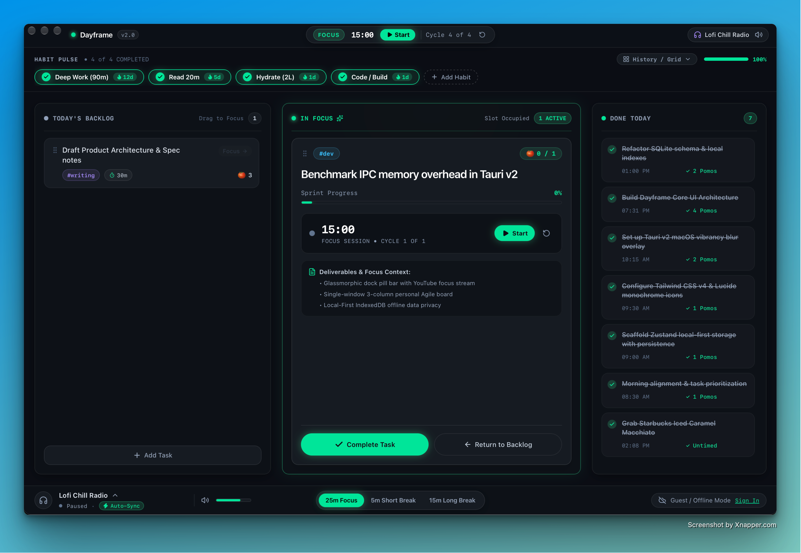

# Dayframe ⏱️✨

<div align="center">



**A solo, local-first personal productivity macOS desktop application designed for deep focus, agile day-sprinting, and habit mastery.**

[](https://tauri.app/)
[](https://react.dev/)
[](https://tailwindcss.com/)
[](https://zustand-demo.pmnd.rs/)
[](LICENSE)

</div>

---

## 🌌 Overview

**Dayframe** is built exclusively as a **solo, local-first desktop productivity environment**. It eliminates corporate telemetry, team channels, and meeting clutter in favor of a single-user flow designed to keep you in flow state:

- **Personal 3-Column Agile Board**: Drag-and-drop sprint board enforcing single-task focus.
- **Daily Habit Pulse & Heatmap**: Habit tracking with a GitHub/Habitify-inspired 8-week consistency heatmap.
- **Integrated Pomodoro Engine**: Per-task timer durations, untimed personal tasks, and cycle tracking.
- **Headless YouTube Ambient Streamer**: Embedded focus music synced directly to your sprint timer.
- **Midnight Mint Aesthetic**: Custom macOS dark aesthetic with neon emerald highlights, glassmorphic blur, and tabular monospace numerics.

---

## 🎨 Design System: "Midnight Mint"

Dayframe adheres strictly to the **Midnight Mint** tonal hierarchy:

| Token | Hex / Value | Purpose |
| :--- | :--- | :--- |
| **Canvas Base** | `#0A0D14` | Window background canvas with subtle ambient dot matrix & radial halos |
| **Card Shells** | `#0D1117` | Primary board columns, drawers, and modal containers (`border: 1px solid rgba(255,255,255,0.07)`) |
| **Inset / Tracks** | `#161B22` | Task cards, input tracks, and inactive progress bars (`border: 1px solid rgba(255,255,255,0.05)`) |
| **Primary Accent** | `#00E599` *(Neon Emerald)* | Active sprint progress, completed badges, and primary action CTAs |
| **Secondary Accents** | `#38BDF8` *(Cyan)*, `#A78BFA` *(Violet)*, `#F59E0B` *(Amber)* | Category pills (`#dev`, `#writing`, `#personal`) |
| **Typography** | Inter / SF Pro + **JetBrains Mono** | Tabular figures (`tnum 1`) for timers, timestamps, and streak counters |

---

## ✨ Key Features

### 1. 🗂️ 3-Column Personal Agile Sprint Board
- **Column 1: Today's Backlog**
  - Card title, category tag capsule, and estimated Pomodoro cycles (`🍅 2`).
  - Support for **Untimed / Personal Tasks** (`0m` duration, e.g., errands, coffee runs).
  - Hover actions: Quick "Focus" button and delete button.
  - Inline `#161B22` task creation bar with duration quick-selectors (`15m`, `25m`, `30m`, `45m`, `60m`, `Untimed`).
  - Slick click-and-drag reordering into active focus.
- **Column 2: In Focus (Hero Active Task)**
  - **Single-Focus Constraint**: Prohibits distractions by strictly limiting active focus to **one task at a time**.
  - 6px progress track filled with `#00E599` based on real-time sprint completion.
  - Large headline title, deliverables checklist, and integrated timer controls (Play / Pause / Reset).
  - Quick action buttons: Neon Emerald **"Complete Task"** and ghost **"Return to Backlog"**.
- **Column 3: Done Today**
  - Strikethrough titles in muted platinum (`#94A3B8`).
  - Neon emerald checkmarks and JetBrains Mono completion timestamps.
  - Compact **"Undo"** action to return tasks to the backlog if clicked by accident.

### 2. ⚡ Daily Habit Pulse & Consistency Heatmap
- **Habit Pulse Strip**:
  - Horizontal pill strip tracking rituals with one-click toggles and flame streak counters (`🔥 12d`).
  - Real-time completion progress bar with percentage readout.
  - Slide-in inline form to add custom habits with category badges.
- **Expandable Heatmap Grid (Habitify / GitHub Style)**:
  - Toggle pill button: `[ ▦ History / Grid ]` with a smooth animated dropdown.
  - Trailing 8 weeks (~56 days) arranged in 7-day rows (Mon–Sun) × 8 week columns.
  - 10px × 10px rounded squares with 3px gaps.
  - Color-tiered cells: Inactive `#161B22`, Completed `#00E599`, High-Focus `#6DFFBA`.
  - Interactive tooltips showing formatted timestamps and completion status.
  - Dynamic 30-day completion rate percentage calculation.

### 3. 🎧 Headless YouTube Ambient Audio Engine
- **Background Player**:
  - Powered by the official YouTube IFrame Player API mounted in an invisible, zero-layout container.
  - Seamless audio looping (`loop: 1`), stripped of video UI overhead.
  - Curated focus stream presets:
    1. **Lofi Chill Radio** (`jfKfPfyJRdk`)
    2. **Synthwave Focus** (`4xDzrJKXOOY`)
    3. **Deep Ambient Noise** (`WPni755-Krg`)
    4. **Custom Stream URL**: Paste any YouTube URL or Video ID to stream ambient audio.
- **Pomodoro Auto-Sync**:
  - Automatically starts audio when you launch a focus sprint (`Start`).
  - Automatically pauses audio when the sprint completes or transitions to break.
  - Independent playback controls from the dock or title bar without halting the timer clock.
- **Bottom Dock Controls**:
  - Headphone icon with an active neon mint visualizer pulse dot (`#00E599`).
  - Custom Midnight Mint volume slider and one-click mute toggle.
  - Popover drawer for stream switching and custom URL inputs.

### 4. 🔒 Local-First Architecture & Privacy
- **Zero Cloud Lock-in**: All state (habits, tasks, timer settings, audio presets, history) persists locally in your browser's IndexedDB via `idb-keyval`.
- **Offline Capable**: Fully functional without internet connectivity.
- **Cloud Sync Ready**: Built-in toggle for Supabase synchronization when remote sync is desired.

---

## 🛠️ Architecture & Tech Stack

```
day-frame/
├── src/
│   ├── components/
│   │   ├── AgileBoard.tsx        # 3-Column Agile Board with Drag & Drop
│   │   ├── AudioEngine.tsx       # Headless YouTube IFrame Audio Player
│   │   ├── BottomDock.tsx        # Dock with stream selector, volume & mode toggles
│   │   ├── HabitPulse.tsx        # Habit pulse strip & 8-week consistency heatmap
│   │   └── TitleBar.tsx          # macOS window chrome with live Pomodoro pill
│   ├── hooks/
│   │   └── useTimerEngine.ts     # Global 1000ms Pomodoro ticking engine
│   ├── store/
│   │   ├── idbStorage.ts         # Asynchronous IndexedDB storage adapter
│   │   └── useDayframeStore.ts   # Unified Zustand store with persistence
│   ├── types/
│   │   ├── index.ts              # Data contracts (Habit, AgileTask, Pomodoro, Audio)
│   │   └── store.ts              # Re-exports for store contracts
│   ├── App.tsx                   # Main macOS application shell
│   ├── App.css                   # Midnight Mint design tokens & animations
│   └── main.tsx                  # React 19 entrypoint
├── src-tauri/                    # Tauri v2 macOS desktop native wrapper (Rust)
└── docs/images/                  # Screenshots & UI assets
```

- **Frontend**: React 19, TypeScript, Vite 8
- **Styling**: Tailwind CSS v4, Lucide React icons
- **State & Storage**: Zustand 5, `idb-keyval` (IndexedDB persistence)
- **Desktop Runtime**: Tauri v2 (Rust backend with native macOS vibrancy)

---

## 🚀 Getting Started

### Prerequisites
- [Node.js](https://nodejs.org/) (v18 or higher recommended)
- [Rust & Cargo](https://www.rust-lang.org/tools/install) (only required if building the native desktop app with Tauri)

### 1. Clone the Repository
```bash
git clone https://github.com/jayanthmpasupuleti/day-frame.git
cd day-frame
```

### 2. Install Dependencies
```bash
npm install
```

### 3. Run Development Server (Web Mode)
```bash
npm run dev
```
Open [http://localhost:1420](http://localhost:1420) in your browser.

### 4. Run as Desktop Application (Tauri v2)
```bash
npm run tauri dev
```

### 5. Build for Production
```bash
# Build frontend web assets
npm run build

# Build native macOS release binary (.app / .dmg)
npm run tauri build
```

---

## ⌨️ Shortcuts & Interactions

- `Enter`: Submit new task in Backlog or new ritual in Habit Pulse.
- `Esc`: Dismiss modal or slide-in form.
- `Drag & Drop`: Grab any task card from Backlog and drop it into In Focus to begin a sprint.
- `Auto-Sync`: Toggle the `Auto-Sync` pill in the bottom dock to link ambient music with your focus sprints.

---

## 📄 License

This project is licensed under the [MIT License](LICENSE).
